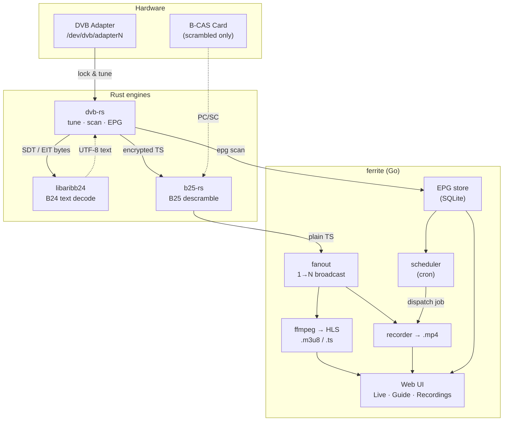

# ferrite

> Self-hosted **ISDB-T** TV stack — tune, descramble, record, and stream
> live to your LAN. Go orchestrator driving three Rust engines.

## The stack



The hot path per active channel is a two-process pipe —
`dvb-rs tune … | b25-rs -v 0 - -` — broadcast 1→N by `fanout` (slow
consumers are dropped, never block live playback). `dvb-rs epg` feeds the
EPG store on a timer.

## Layout

```
cmd/isdbd/           entrypoint
internal/
  config/            channels.json + daemon TOML
  proc/              subprocess helpers (pgrp, stderr-to-slog)
  tuner/             adapter pool + dvb-rs CLI wrapper + leases
  fanout/            TS stream 1→N broadcaster (chunk pool, drop on slow)
  store/             sqlite (epg events, recordings, schedules)
  epg/               periodic dvb-rs epg ingest
  recorder/          recording job lifecycle
  scheduler/         cron-driven recording trigger
  hls/               ffmpeg subprocess + m3u8 serving
  netaddr/           which addresses a viewer can reach this box at
  api/               chi router + handlers
  web/               embedded static SPA
configs/             example daemon config
scripts/             systemd units (ferrite.service = --user, isdbd.service = system)
libaribb24-rs/       ARIB B24 text decoder (Rust, submodule)
libaribb25-rs/       ARIB B25 descrambler (Rust, submodule)
dvb-rs/              DVB tuner frontend (Rust, submodule)
```

## Quickstart

```bash
git clone --recursive https://github.com/DuckFeather10086/ferrite.git
cd ferrite
./bootstrap.sh build
go run ./cmd/isdbd -config configs/isdbd.toml
```

Open the web UI in a browser (Live / Guide / Schedules / Recordings).

Live TV is one URL — `http://<host>:8010/stream.m3u8` — and it plays
whatever is tuned, so a bookmark in VLC or on an iPad survives every channel
change. The startup log prints it for every address the box answers on
(loopback, LAN, tailnet); `/api/status` reports the same list, which is what
`ferrite-tui` shows in its header.

### Or leave it running

```bash
make install-service      # systemd --user unit + ferrite-tui on $PATH
make status               # is it up, and what is the tuner doing
make logs                 # journalctl -f
make restart              # after a rebuild
```

The unit is a **user** service: the tuner and the B-CAS reader are reached
with the invoking user's permissions, so running it as root would need a
second set of polkit rules for nothing. `WorkingDirectory` is the
checkout, because `isdbd.toml` addresses the Rust binaries, `channels.json`
and `storage_root` relatively. `loginctl enable-linger $USER` makes it come
up at boot rather than at login.

Then, from anywhere:

```bash
ferrite-tui               # terminal remote (defaults to localhost:8010)
```

## Build

The two Rust build roots and the Go module build independently:

```bash
# Rust: libaribb24 + dvb-rs share the root virtual workspace
cargo build --release
#   → target/release/dvb-rs

# Rust: b25-rs has its own inner workspace (excluded from the root one)
cargo build --release --manifest-path libaribb25-rs/Cargo.toml
#   → libaribb25-rs/target/release/b25-rs

# Go orchestrator (CGO-free, web UI embedded)
go build ./...
```

`bootstrap.sh` wraps these and verifies the submodules are checked out.

## Releases

Pre-built tarballs for **linux/amd64** and **linux/arm64** at
[GitHub Releases](https://github.com/DuckFeather10086/ferrite/releases).

```bash
curl -L "https://github.com/DuckFeather10086/ferrite/releases/download/v1.0.0/ferrite-v1.0.0-linux-amd64.tar.gz" | tar xz
cd ferrite-v1.0.0-linux-amd64
sudo cp ferrite dvb-rs b25-rs /usr/local/bin/
```

## Bundled font

`web/public/fonts/MPLUSRounded1c-Regular-v22.woff2` — M PLUS Rounded 1c,
OFL 1.1, with the notice and licence beside it. It is the rounded gothic
ARIB captions are drawn in, and it ships because an `.ass` sidecar's sizes
are only right for the font it names: an ASS size is a line box rather than
an em, so the wrong font draws the words at the wrong size for the boxes the
same file draws. The only webfont here — everything else uses the system
stack. Replacing it means renaming the file: `/fonts/` is served immutable.

## Runtime requirements

- A USB ISDB-T tuner at `/dev/dvb/adapter*/`.
- `ffmpeg` / `ffprobe` on `$PATH`.
- For scrambled channels: **`pcscd`** + B-CAS card reader (polkit rule
  for the invoking user). FTA-only setups can run without `b25-rs`.
