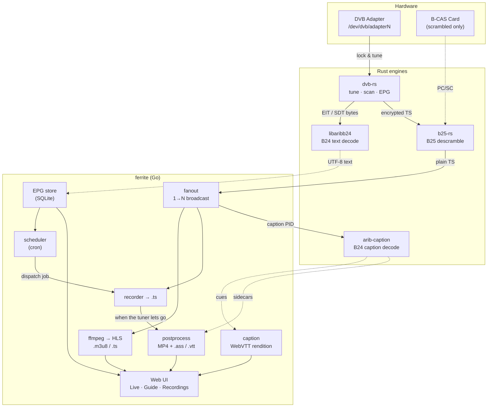

# ferrite

> Self-hosted **ISDB-T** TV stack — tune, descramble, record, caption, and
> stream live to your LAN. Go orchestrator driving four Rust engines.

## The stack



The hot path per active channel is a two-process pipe —
`dvb-rs tune … | b25-rs -v 0 - -` — broadcast 1→N by `fanout` (slow
consumers are dropped, never block live playback). `dvb-rs epg` feeds the
EPG store on a timer — the titles reaching it as UTF-8 because `arib-b24`,
which dvb-rs links rather than spawns, decoded them out of ARIB's own
character set on the way. A second consumer of the same tune feeds
`arib-caption`, because ffmpeg cannot decode ARIB captions: its
`arib_caption` codec has no decoder unless it was built against
libaribb24 or libaribcaption, and a distribution build is not.

## Layout

```
cmd/isdbd/           entrypoint
cmd/ferrite-tui/     terminal remote (a REST client, no TV state of its own)
internal/
  config/            channels.json + daemon TOML
  proc/              subprocess helpers (pgrp, stderr-to-slog)
  tuner/             adapter pool + dvb-rs CLI wrapper + leases
  fanout/            TS stream 1→N broadcaster (chunk pool, drop on slow)
  store/             sqlite (epg events, recordings, schedules)
  epg/               periodic dvb-rs epg ingest
  recorder/          recording job lifecycle
  scheduler/         cron-driven recording trigger
  hls/               ffmpeg subprocess + m3u8 serving
  caption/           live captions → a WebVTT rendition beside the segments
  postprocess/       after the tuner lets go: MP4 + .ass / .vtt sidecars
  netaddr/           which addresses a viewer can reach this box at
  api/               chi router + handlers
  web/               embedded static SPA (//go:embed of the export)
web/                 the SPA's source (Bun + Next.js), incl. the caption fonts
agent/               MCP server + tool-calling loop over the same REST API
configs/             example daemon config
scripts/             systemd units (ferrite.service = --user, isdbd.service = system)
libaribb24-rs/       ARIB B24 text decoder (Rust, submodule)
libaribb25-rs/       ARIB B25 descrambler (Rust, submodule)
libaribcaption-rs/   ARIB B24 caption decoder + WebVTT/ASS renderers (submodule)
dvb-rs/              DVB tuner frontend (Rust, submodule)
```

## Quickstart

```bash
git clone --recursive https://github.com/DuckFeather10086/ferrite.git
cd ferrite
make deps                 # submodules + bun install + go mod tidy
make build                # Rust engines, then the web UI, then the daemon
make run                  # ./isdbd --config configs/isdbd.toml
```

The first start has no channel list, so it sweeps UHF 13–62 before anything
else comes up and writes `channels.json` from what locks — a few minutes, once.
That file is yours and is not tracked: the frequencies are a property of where
the aerial is. `POST /api/scan` re-runs the sweep later, and `dvb-rs scan
--merge` folds a rescanned mux into it without disturbing curated names.

Open the web UI in a browser (Live / Guide / Schedules / Recordings).

Live TV is one URL — `http://<host>:8010/stream.m3u8` — and it plays
whatever is tuned, so a bookmark in VLC or on an iPad survives every channel
change. The startup log prints it for every address the box answers on
(loopback, LAN, tailnet); `/api/status` reports the same list, which is what
`ferrite-tui` shows in its header.

### Or leave it running

```bash
make install-service      # systemd --user unit + ferrite-tui on $PATH
make status               # is it up, and what is the tuner doing
make logs                 # journalctl -f
make restart              # after a rebuild
```

The unit is a **user** service: the tuner and the B-CAS reader are reached
with the invoking user's permissions, so running it as root would need a
second set of polkit rules for nothing. `WorkingDirectory` is the
checkout, because `isdbd.toml` addresses the Rust binaries, `channels.json`
and `storage_root` relatively. `loginctl enable-linger $USER` makes it come
up at boot rather than at login.

Then, from anywhere:

```bash
ferrite-tui               # terminal remote (defaults to localhost:8010)
```

## Build

`make build` runs all of it in order — `make rust`, `make web`, `make go` —
and each part stands alone:

```bash
# Rust: libaribb24, libaribcaption and dvb-rs share the root virtual workspace
cargo build --release
#   → target/release/dvb-rs
#   → target/release/arib-caption

# Rust: b25-rs has its own inner workspace (excluded from the root one,
# because it vendors the aribb25 C bindings and needs its own resolution)
cargo build --release --manifest-path libaribb25-rs/Cargo.toml
#   → libaribb25-rs/target/release/b25-rs

# Web UI: Bun + Next.js static export, copied into internal/web/dist
cd web && bun run build

# Go orchestrator (CGO-free, web UI embedded)
go build -o isdbd ./cmd/isdbd
```

The daemon spawns those Rust binaries by the paths in `configs/isdbd.toml`,
which are relative to the checkout — so run it from here, or edit them.

## Captions

ARIB STD-B24 captions, decoded by us because ffmpeg cannot, and offered in
whichever form the thing drawing them can honour:

- **Live** — a WebVTT rendition is published beside the video segments, so it
  is in the manifest that `/stream.m3u8` serves: VLC, mpv and iOS Safari pick
  it up on their own. In the web UI the Live page has `CAPTIONS On|Off` under
  the picture, because a browser's own captions control is buried two menus
  deep (Chromium's control bar has no captions button at all).
- **Recordings** — the post-pass writes two sidecars next to the MP4. The
  `.ass` keeps ARIB's own placement, colours and cell metrics, including DRCS
  glyphs drawn as outlines; the `.vtt` is the same words as plain lines, which
  is all a browser's native `<track>` can draw. The Recordings player offers
  `ARIB | Text | Off` and falls back from ARIB to Text for as long as the
  video alone is fullscreen, where a DOM overlay cannot be seen.

Both forms place a caption just above where a player draws its progress bar,
rather than the lower third a player's own default reserves for its controls.

## Bundled fonts

Two, both in `web/public/fonts/` with their notices beside them, and the only
webfonts here — everything else uses the system stack. Replacing either means
renaming the file: `/fonts/` is served immutable.

`MPLUSRounded1c-Regular-v22.woff2` — M PLUS Rounded 1c, OFL 1.1. The rounded
gothic ARIB captions are drawn in. It ships because an `.ass` sidecar's sizes
are only right for the font it names: an ASS size is a line box rather than an
em, so the wrong font draws the words at the wrong size for the boxes the same
file draws.

`AribGaiji-Regular-v1.woff2` and `.ttf` — the ARIB additional symbols (区85-86
and 区90-94), public domain, subset from 和田研中丸ゴシック2004ARIB. The font
above is a Japanese *text* font and does not have them: 414 of the 529 the
decoder can emit are missing from it, and 37 — the honorifics and instrument
abbreviations in 区92, and the 「No.」 at 92区94点 — have no Unicode codepoint
in any version, so they travel as ARIB's own Private Use Area codepoints and
nothing but this file can draw them. It carries the first font's em and
vertical metrics, so a gaiji lands in its cell at the same size as the kanji
beside it, and it sits *second* in the caption font stack: symbols only, so the
text font still draws everything ordinary.

The `.ttf` is the same font in the form you install. The browser needs neither
— both travel in the binary — but an `.ass` sidecar is drawn by whatever player
opens it, so `curl -O http://<host>:8010/fonts/AribGaiji-Regular-v1.ttf` into
`~/.local/share/fonts` is what gets the symbols into mpv or VLC. Rebuilding it
after a table change is `libaribcaption-rs/scripts/build_gaiji_font.py`, which
takes the codepoints from `tables.rs` rather than a list of its own.

## Releases

Pre-built tarballs for **linux/amd64** and **linux/arm64** at
[GitHub Releases](https://github.com/DuckFeather10086/ferrite/releases).

```bash
curl -L "https://github.com/DuckFeather10086/ferrite/releases/download/v0.1.0/ferrite-v0.1.0-linux-amd64.tar.gz" | tar xz
cd ferrite-v0.1.0-linux-amd64
sudo cp ferrite dvb-rs b25-rs arib-caption /usr/local/bin/
```

## Runtime requirements

- A USB ISDB-T tuner at `/dev/dvb/adapter*/`.
- `ffmpeg` / `ffprobe` on `$PATH`.
- For scrambled channels: **`pcscd`** + B-CAS card reader (polkit rule
  for the invoking user). FTA-only setups can run without `b25-rs`.
